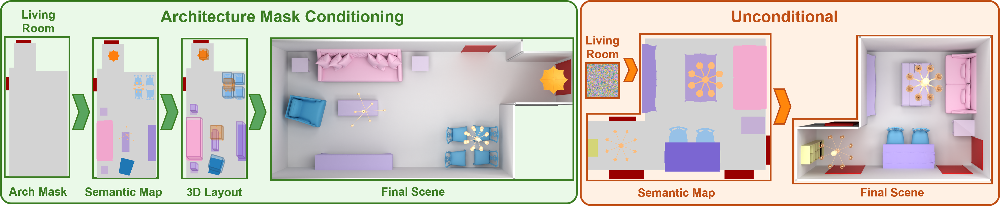

# SemLayoutDiff

<p align="center">
  <strong>Official PyTorch implementation of "SemLayoutDiff: Semantic Layout Diffusion for 3D Indoor Scene Generation"</strong>
</p>

<p align="center">
  <a href="https://sun-xh.github.io/">Xiaohao Sun</a><sup>1</sup>, 
  <a href="https://dv-fenix.github.io/">Divyam Goel</a><sup>2</sup>, 
  <a href="https://angelxuanchang.github.io/">Angel X. Chang</a><sup>1,3</sup>
</p>

<p align="center">
  <sup>1</sup>Simon Fraser University <sup>2</sup>CMU <sup>3</sup>Alberta Machine Intelligence Institute (Amii)
</p>

<p align="center">
  <a href="https://3dlg-hcvc.github.io/SemLayoutDiff/">🌐 Project Website</a> | 
  <a href="https://arxiv.org/abs/2508.18597v1">📄 Paper</a> | 
</p>

<p align="center">
  
</p>

## 📋 Table of Contents

- [🔍 Overview](#-overview)
- [🚀 Quick Start](#-quick-start)
- [📦 Pretrained Weights](#-pretrained-weights)
- [📊 Dataset Preparation](#-dataset-preparation)
- [🏋️ Model Training](#️-model-training)
- [🎨 Scene Generation](#-scene-generation)
- [🎨 Scene Rendering](#-scene-rendering)
- [📈 Evaluation](#-evaluation)
- [🎯 Citation](#-citation)
- [🙏 Acknowledgements](#-acknowledgements)


## 🔍 Overview

SemLayoutDiff is a two-stage approach to generate realistic 3D indoor scenes condition on room type and room architecture mask. Our method combines semantic layout generation with attribute prediction to create complete 3D rooms.

### 🏗️ Architecture

Our approach consists of two main components:

1. **Semantic Layout Diffusion Network (SLDN)**: Generates 2D semantic layout maps from room type conditioning using a diffusion process using discrete diffsion model.

2. **Attribute Prediction Model (APM)**: Takes the generated 2D semantic layouts and predicts full 3D object attributes including positions, orientations, and scales for each instance. 

After the above two stage, we perform object retrieval based on the object category and size to construct the complete 3D scene.


## 🚀 Quick Start

### Installation

1. **Clone the repository**
```bash
git clone https://github.com/3dlg-hcvc/SemLayoutDiff.git
cd SemLayoutDiff
```

2. **Set up the environment**
```bash
conda env create -f environment.yml
conda activate semlayoutdiff

# Install semlayoutdiff
pip install -e .

# Install ai2thor for libsg build
pip install --extra-index-url https://ai2thor-pypi.allenai.org ai2thor==0+8524eadda94df0ab2dbb2ef5a577e4d37c712897
```

### 📦 Pretrained Weights

We provide pretrained weights for both model components to enable quick scene generation without training from scratch.

**Download Links:**
- **SLDN (Semantic Layout Diffusion Network)**: [link](https://aspis.cmpt.sfu.ca/projects/semdifflayout/checkpoints/sldn_checkpoints.tar.gz)
- **APM (Attribute Prediction Model)**: [link](https://aspis.cmpt.sfu.ca/projects/semdifflayout/checkpoints/apm_checkpoint.ckpt)

**Setup:**
```bash
# Create checkpoints directory
mkdir -p checkpoints && cd checkpoints

# Download and extract pretrained weights
# SLDN weights
wget [SLDN_DOWNLOAD_LINK] -O checkpoints/sldn_checkpoints.tar.gz
tar -xf sldn_checkpoints.tar.gz

# APM weights  
wget [APM_DOWNLOAD_LINK] -O apm_checkpoints.ckpt
```

## 📊 Dataset Preparation

### 🎯 What Data Do You Need?

The data requirements depend on your use case:

| **Use Case** | **Required Data** | **Description** |
|--------------|-------------------|-----------------|
| **🎨 Scene Generation Only** (using pretrained models) | `threed_future_model_unified.json` | 3D furniture model database for object retrieval |
| **🏋️ Training SLDN** | `unified_w_arch_120x120.npy` | Preprocessed 2D semantic layouts for diffusion training |
| **🏋️ Training APM** | `unified_w_arch_3dfront/`| 3D scene data with semantic maps and object attributes |

### Quick Start (Recommended)

**For most users**: Download our preprocessed datasets built on [3D-FRONT](https://tianchi.aliyun.com/dataset/65347) and [3D-FUTURE](https://tianchi.aliyun.com/dataset/65347):

```bash
# Create datasets directory and download processed data
mkdir -p datasets && cd datasets
wget [DOWNLOAD_LINK] -O 3dfront_processed.tar.gz
tar -xzf 3dfront_processed.tar.gz --strip-components=1 && cd ..
```

**Download Link:** [3D-FRONT Processed Dataset](https://aspis.cmpt.sfu.ca/projects/semdifflayout/data/3dfront_processed.tar.gz)

**What's included:**
- **`unified_w_arch_120x120.npy`**: SLDN training data (2D semantic layouts with room architecture)
- **`unified_w_arch_3dfront/`**: APM training dataset (3D scenes with object attributes and semantic maps)
- **`threed_future_model_unified.json`**: 3D-FUTURE model database (required for object retrieval during scene generation)

**Note:** Data splits and metadata are included in the repository under `preprocess/metadata/` (no separate download needed).

### Expected Directory Structure

<details>
<summary>Click to expand directory structure</summary>

```
datasets/
├── unified_w_arch_120x120.npy                # SLDN training data (required!)
├── unified_w_arch_3dfront/                   # APM training dataset
│   ├── train/val/test/                       # Scene data with .json/.png files
├── threed_future_model_unified.json           # 3D-FUTURE models
└── results/                                  # Generated outputs
```
</details>

**Getting Started with Custom Processing:**

For detailed instructions on processing your own data from raw 3D-FRONT datasets, see [`preprocess/README.md`](./preprocess/README.md).


## 🏋️ Model Training

Our approach consists of two main components that can be trained independently:

1. **Semantic Layout Diffusion Network (SLDN)**: Generates 2D semantic maps from room type conditioning
2. **Attribute Prediction Model (APM)**: Projects 2D semantic maps to full 3D object layouts with attributes

### ⚙️ Configuration System

Our training uses YAML configuration files in the `configs/` directory. For reproducing paper results, use:
- **`configs/sldn/mixed_con_unified_config.yaml`** for SLDN training
- **`configs/apm/unified_config.yaml`** for APM training

### Training SLDN

Train the semantic layout diffusion model on 3D-FRONT dataset:

```bash
python scripts/train_sldn.py --config configs/sldn/mixed_con_unified_config.yaml
```

Key parameters include `batch_size: 48`, `data_size: 120` for 120×120 semantic maps, and `num_categories: 38` object types. The model uses `room_type_condition: true` and `w_arch: true` to enable conditioning on both room types and architectural elements.

**Requirements:**
- **`datasets/unified_w_arch_120x120.npy`** - Essential SLDN training data
- GPU with ≥16GB memory for the default batch size

### Training APM

Train the attribute prediction model to map semantic layouts to 3D scenes:

```bash
python scripts/train_apm.py --config-path=../configs/apm --config-name=unified_config
```

**Requirements:**
- **`datasets/unified_w_arch_3dfront/`** - Essential APM training data
- **`datasets/threed_future_model_unified.json`** - 3D model database

## 🎨 Scene Generation

### Step-by-Step Generation

#### 1. Semantic Layout Sampling

Generate 2D semantic maps using the trained SLDN:

```bash
python scripts/sample_layout.py --config configs/sldn/sample_layout.yaml
```

Configure the script by editing `sample_layout.yaml`. Set `room_type` to `unified` and `sample_room_type` to 0, 1, or 2 for bedroom, dining room, and living room respectively. Use `samples: 5` to generate 5 layouts and `condition_type: "arch"` for architecture conditioning. Set `w_arch: true` to include doors/windows and specify `out_dir` for the output location.

#### 2. 3D Scene Generation

Convert semantic layouts to full 3D scenes with the APM:

```bash
python scripts/inference.py --config-path=../configs/apm --config-name=unified_config
```

Modify `unified_config.yaml` to set `semantic_map_dir` to your generated layouts directory, `room_type` to match the layout room type (bedroom/livingroom/diningroom), and `output_dir` for results. The script uses `checkpoint_path` to load the trained APM model.

**Output:** Generated 3D scenes are saved as JSON files containing object positions, orientations, scales, categories, and 3D model IDs for furniture retrieval.

## 🎨 Scene Rendering

Render generated scenes using the [SmartScenes ToolKit (SSTK)](https://github.com/smartscenes/sstk) for visualization and quantitative evaluation.

### Setup

1. **Install SSTK** following the instructions in their [repository](https://github.com/smartscenes/sstk)
2. **Prepare 3D-FRONT metadata** from [sstk-metadata](https://github.com/smartscenes/sstk-metadata) following their README setup instructions

### Render Semantic Top-Down Views

```bash
NODE_BASE_URL=<your_root_path> ~/path/to/sstk/ssc/render-file.js \
  --assetType scene \
  --assetGroups 3dfModel,3dfTexture \
  --input datasets/results/scenestate_files/your_scene.json \
  --output_dir rendered_scenes \
  --color_by objectType \
  --index preprocess/metadata/semantic_color_index_livingdiningroom.csv \
  --restrict_to_color_index \
  --assetInfo '{"archOptions":{"includeWallHoleBoundingBoxes":true}}'
```

**Parameters:**
- `--input`: Path to generated scenestate JSON file
- `--index`: Semantic color mapping (use `semantic_color_index_bedroom.csv` for bedroom scenes)
- `--output_dir`: Directory for rendered outputs
- `--assetInfo`: Includes walls and doors in rendering with architectural options

The semantic color indices are provided in `preprocess/metadata/` for different room types.

<details>
<summary><strong>Export Scene as GLB File</strong> (click to expand)</summary>

Export generated scenes as GLB (GL Transmission Format Binary) files for use in 3D applications:

```bash
NODE_BASE_URL=<your_root_path> ~/path/to/sstk/ssc/export-mesh.js \
  --assetType scene \
  --assetGroups 3dfModel,3dfTexture \
  --input datasets/results/scenestate_files/your_scene.json \
  --input_type path \
  --output_format glb \
  --output_dir datasets \
  --color_by objectType \
  --index preprocess/metadata/semantic_color_index_livingdiningroom.csv \
  --restrict_to_color_index \
  --assetInfo '{"archOptions":{"includeWallHoleBoundingBoxes":true}}'
```

**Parameters:**
- `--input`: Path to generated scenestate JSON file
- `--input_type`: Set to `path` for file path input
- `--output_format`: Set to `glb` for GLB export format
- `--output_dir`: Directory for exported GLB files
- `--index`: Semantic color mapping (use `semantic_color_index_bedroom.csv` for bedroom scenes)
- `--assetInfo`: Includes walls and doors in the exported model with architectural options

The exported GLB files can be imported into Blender for better visualization.

</details>


## 📈 Evaluation

Evaluate generated scenes using multiple quantitative metrics:

```bash
python scripts/eval.py --config configs/evaluation_config.yaml
```

The evaluation script computes four key metrics:

**1. Out-of-Boundary (OOB) Rate**: Measures the percentage of generated objects that are placed outside the room boundaries or overlap with walls/architectural elements.

**2. Scene Classification Accuracy (SCA)**: Trains a CNN classifier on real scene renderings and tests it on generated scenes to measure visual realism and scene coherence.

**3. Fréchet Inception Distance (FID)**: Computes FID and KID scores between real and generated scene renderings to measure visual quality and diversity.

**4. KL Divergence**: Measures the difference between object category distributions in real vs. generated scenes across 34 furniture types (beds, chairs, tables, etc.).

For scene plausibility evaluation, please refer to [SceneEval](https://github.com/3dlg-hcvc/SceneEval).


## 🎯 Citation

If you find this work useful, please consider citing our paper:

```bibtex
@article{sun2025semlayoutdiff,
  title={{SemLayoutDiff}: Semantic Layout Generation with Diffusion Model for Indoor Scene Synthesis}, 
  author={Xiaohao Sun and Divyam Goel and Angel X. Chang},
  year={2025},
  eprint={2508.18597},
  archivePrefix={arXiv},
}
```

## 🙏 Acknowledgements

Thanks to [Multinomial Diffusion](https://arxiv.org/abs/2102.05379), whose implementations form the foundation of our diffusion models. And thanks to [BlenderProc-3DFront](https://github.com/yinyunie/BlenderProc-3DFront) and [DiffuScene](https://github.com/tangjiapeng/DiffuScene) that our data processing based on their code.


This work was funded in part by a CIFAR AI Chair and NSERC Discovery Grants, and enabled by support from the <a href="https://alliancecan.ca/">Digital Research Alliance of Canada</a> and a CFI/BCKDF JELF.
We thank Ivan Tam for help with running SceneEval; Yiming Zhang and Jiayi Liu for suggestions on figures; Derek Pun, Dongchen Yang, Xingguang Yan, and Manolis Savva for discussions, proofreading, and paper suggestions.
